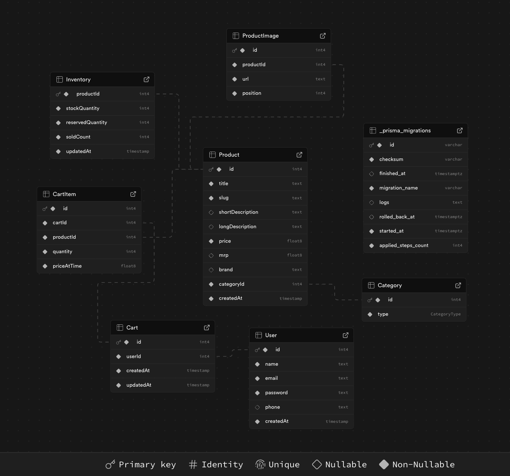

# House of Homegrown

A premium Indian D2C e-commerce platform for sustainable, handcrafted products made with love and tradition.

## 🏠 About

House of Homegrown is a modern e-commerce platform that celebrates traditional Indian craftsmanship while embracing sustainable practices. Inspired by "Roti, Kapda aur Makan", we offer a curated collection of:

- **Textiles** - Handwoven fabrics and traditional textiles
- **Home & Living** - Artisan-made home decor and functional items  
- **Wellness** - Natural and organic personal care products
- **Lifestyle** - Eco-friendly everyday essentials

## 🚀 Features

- **Premium D2C Design** - Clean, modern interface with earthy brand colors
- **Guest Cart System** - JWT-based authentication for seamless shopping
- **Mobile-First** - Responsive design optimized for all devices
- **Product Showcase** - Beautiful product galleries with filtering
- **Sustainable Focus** - Highlighting eco-friendly and traditional products

## 🛠 Tech Stack

### Frontend
- **React 19** with Vite
- **Tailwind CSS** for styling
- **React Router** for navigation
- **Lucide React** for icons
- **shadcn/ui** components

### Backend
- **Node.js** with Express
- **Prisma ORM** with PostgreSQL
- **JWT Authentication** for guest sessions
- **Cookie-based** session management

## 🎨 Brand Colors

- **Primary Earthy Brown**: `#8B5E3C`
- **Secondary Beige**: `#F5F1E8` 
- **Accent Green**: `#6B8E23`
- **Background**: `#FAFAF8`

## 📱 Typography

- **Brand Name**: Playfair Display (serif)
- **Headings**: Inter SemiBold
- **Body Text**: Inter Regular
- **Buttons**: Inter Medium

## 🚀 Getting Started

### Prerequisites
- Node.js 18+
- PostgreSQL database
- npm or yarn

### Installation

1. Clone the repository
```bash
git clone https://github.com/your-username/house-of-homegrown.git
cd house-of-homegrown
```

2. Install backend dependencies
```bash
cd backend
npm install
```

3. Install frontend dependencies
```bash
cd ../frontend
npm install
```

4. Set up environment variables
```bash
# Backend (.env)
DATABASE_URL="your-postgresql-connection-string"
JWT_SECRET="your-jwt-secret"

# Frontend (.env)
VITE_API_URL="http://localhost:3001/api"
```

5. Run database migrations
```bash
cd backend
npx prisma migrate dev
npx prisma db seed
```

6. Start the development servers
```bash
# Backend (Terminal 1)
cd backend
npm start

# Frontend (Terminal 2)  
cd frontend
npm run dev
```

## 📦 Project Structure

```
house-of-homegrown/
├── backend/
│   ├── prisma/          # Database schema and migrations
│   ├── src/
│   │   ├── controllers/ # Route handlers
│   │   ├── services/    # Business logic
│   │   ├── middlewares/ # Custom middleware
│   │   └── routes/      # API routes
│   └── server.js        # Express server
├── frontend/
│   ├── public/          # Static assets
│   ├── src/
│   │   ├── components/  # React components
│   │   ├── pages/       # Page components
│   │   ├── services/    # API services
│   │   ├── hooks/       # Custom hooks
│   │   └── utils/       # Utility functions
│   └── index.html       # HTML template
└── docs/                # Documentation
```


## ER Model



### Tables (Models in Prisma)

- **User** - Customer accounts with authentication fields (name, email, password, phone)
- **Category** - Product categories with enum types (TEXTILES, HOME_LIVING, WELLNESS, LIFESTYLE)
- **Product** - Product catalog with pricing, descriptions, brand information, and category relationships
- **ProductImage** - Multiple images per product with position ordering for display
- **Inventory** - Stock management with available and reserved quantities tracking
- **Cart** - Shopping cart functionality with timestamp tracking
- **CartItem** - Individual items in shopping carts with quantity and price snapshots

### Key Relationships

- **User to Cart**: One-to-Many (Users can have multiple carts for different purposes)
- **Category to Product**: One-to-Many (Each category contains multiple products)
- **Product to ProductImage**: One-to-Many (Products can have multiple images)
- **Product to Inventory**: One-to-One (Each product has dedicated inventory tracking)
- **Cart to CartItem**: One-to-Many (Carts contain multiple items)
- **Product to CartItem**: One-to-Many (Products can appear in multiple carts)

### Design Features

- **Price Tracking**: CartItem stores `priceAtTime` to preserve pricing when items are added to cart
- **Inventory Management**: Separate `stockQuantity` and `reservedQuantity` for better stock control
- **Flexible Images**: Multiple product images with position-based ordering
- **Cart Status**: Simple cart management with creation and update timestamps
- **Data Integrity**: Cascade deletes and unique constraints ensure data consistency

### Enums

**CategoryType**
- `TEXTILES` - Clothing, fabrics, and textile products
- `HOME_LIVING` - Home decor and living essentials
- `WELLNESS` - Health and wellness products
- `LIFESTYLE` - Lifestyle and personal care items


---

**House of Homegrown** - Supporting local artisans and sustainable living